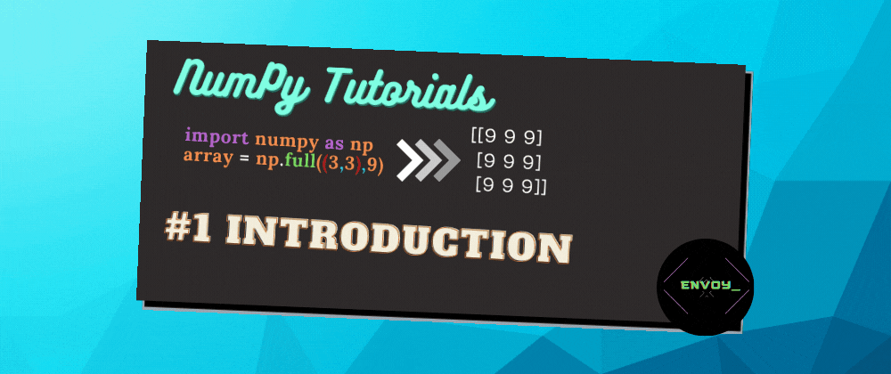

# ⚡️ What is NumPy

NumPy is the fundamental package for scientific computing in Python. It is a Python library that provides a multidimensional array object, various derived objects (such as masked arrays and matrices), and an assortment of routines for fast operations on arrays, including mathematical, logical, shape manipulation, sorting, selecting, I/O, discrete Fourier transforms, basic linear algebra, basic statistical operations, random simulation and much more.

**So basically its an array**

# ⚡️ Advantages of NumPy over lists
- NumPy arrays have a fixed size at creation, unlike Python lists (which can grow dynamically). Changing the size of an ndarray will create a new array and delete the original.
- NumPy arrays facilitate advanced mathematical and other types of operations on large numbers of data. Typically, such operations are executed more efficiently and with less code than is possible using Python’s built-in sequences.
- Linear algebra operations, Fourier transform, and random number generation
- Beyond the fast array-processing capabilities that NumPy adds to Python, one of its primary uses in data analysis is as a container for data to be passed between algorithms and libraries

# ⚡️ Installing NumPy
Open terminal and simply type
```bash
pip install numpy
```
If it doesn't work for you use
```bash
pip3 install numpy
```

# ⚡️ How fast is NumPy over lists

Lets take an example

## Using Lists
```py
import time

start = time.time()

a = range(1000000)

for _ in range(10):
    [x * 2 for x in a]


end = time.time()

print(f"Code executed in {(end-start)*1000} ms")
```

### Output -
```
Code executed in 950.7663249969482 ms
```

## Using NumPy
```py
import numpy as np
import time

start = time.time()

arr = np.arange(1000000)

for _ in range(10):
    arr * 2

end = time.time()

print(f"Code executed in {(end-start)*1000} ms")
```

### Output -
```
Code executed in 15.02847671508789 ms
```


# ⚡️ So NumPy is more than `60` times faster than Lists

# ⚡️Join my Discord for Updates and downloads for future materials

<a href="https://discord.gg/rB9sPEFq9F"></a>